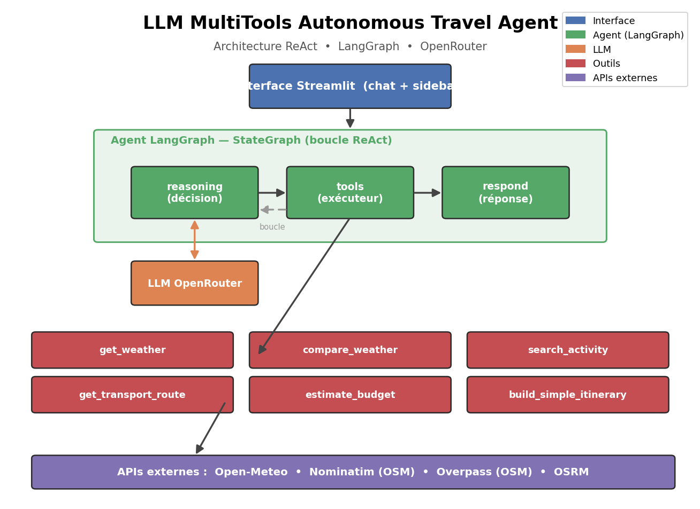

# 🧭 LLM MultiTools Autonomous Travel Agent

> Agent conversationnel autonome basé sur un **Large Language Model**, capable de
> raisonner, sélectionner des outils, appeler des **APIs temps réel** et composer
> une réponse personnalisée — appliqué à l'organisation de sorties urbaines.


---

## 📌 Projet

Contrairement à un chatbot classique, cet agent **raisonne sur l'action à mener**,
**choisit automatiquement les bons outils**, **interroge des APIs externes** et
**combine plusieurs résultats** pour répondre en langage naturel.

Domaine d'application : un **assistant de voyage urbain** qui organise des sorties.

Exemples de requêtes prises en charge :

- « Quel temps fera-t-il demain à Paris ? »
- « Trouve-moi une activité culturelle dans le Marais »
- « Organise-moi une sortie à Montmartre pour 4 personnes avec 40 € par personne »
- « Compare Paris et Lyon pour ce week-end »

---

## 🏗️ Architecture



L'agent suit une architecture **ReAct** (*Reasoning → Action → Observation → Final
Answer*) implémentée avec un `StateGraph` LangGraph :

```
Utilisateur (Streamlit)
        │
        ▼
   Agent LangGraph  ──►  reasoning ──►(a besoin d'un outil ?)──► tools ──┐
        │                    ▲                                            │
        │                    └───────────── observation ─────────────────┘
        ▼
     respond ──► réponse finale personnalisée
```

- **reasoning** : le LLM (via OpenRouter) analyse la demande et décide d'appeler
  ou non des outils (*tool calling* natif).
- **tools** : exécute les outils demandés et renvoie les observations.
- **respond** : produit la réponse finale en langage naturel.

---

## ⚙️ Fonctionnement

```
LLM (raisonnement)
   ↓
Agent (orchestration ReAct + mémoire)
   ↓
Tools (6 outils métier)
   ↓
APIs externes (météo, OSM, itinéraires)
```

### Les 6 outils

| Outil | Fonction | API utilisée |
|-------|----------|--------------|
| Météo | `get_weather(city)` | Open-Meteo (+ fallback Nominatim) |
| Comparaison météo | `compare_weather(city1, city2)` | Open-Meteo |
| Activités | `search_activity(location, type)` | Overpass (OSM) |
| Transport | `get_transport_route(start, end)` | OSRM (+ estimation métro) |
| Budget | `estimate_budget(num_people, total_budget)` | moteur interne |
| Itinéraire | `build_simple_itinerary(...)` | orchestre météo + activités + budget |

---

## 💬 Exemple d'utilisation

> **Utilisateur :** Organise-moi une sortie à Montmartre pour 4 personnes avec 40 € par personne
>
> **Agent :** *(appelle `build_simple_itinerary`)*
> 🗺️ Itinéraire proposé pour « Montmartre » (4 pers., 40 €/pers.)
> ☀️ Météo à Montmartre (demain) : partiellement nuageux, 12–19 °C, pluie 20 %.
> 🎭 Activités suggérées : Musée de Montmartre, Sacré-Cœur, …
> 💶 Budget : transport A/R ~8 € + repas ~18 € + 1 activité → budget total groupe ~160 €.

Voir [`docs/demo.md`](docs/demo.md) pour d'autres scénarios.

---

## 🚀 Installation

```bash
# 1. Cloner le dépôt
git clone https://github.com/your-username/LLM-MultiTools-Agent.git
cd LLM-MultiTools-Agent

# 2. Créer un environnement virtuel
python -m venv .venv
source .venv/bin/activate      # Windows : .venv\Scripts\activate

# 3. Installer les dépendances
pip install -r requirements.txt

# 4. Configurer la clé API
cp .env.example .env
# puis éditer .env et renseigner OPENROUTER_API_KEY
```

---

## ▶️ Lancement

```bash
# Interface Streamlit (depuis la racine du dépôt)
streamlit run app/streamlit_app.py

# Lancer les tests
pytest
```

### Avec Docker

```bash
docker build -t travel-agent .
docker run -p 8501:8501 --env-file .env travel-agent
```

---

## 🧰 Technologies

- **Python 3.12**
- **LLM** : OpenRouter (modèle configurable : `openai/gpt-oss-120b:free`, `minimax/minimax-m1`, …)
- **Framework agent** : LangChain + LangGraph (ReAct, tool calling)
- **Interface** : Streamlit
- **Mémoire** : LangGraph `MemorySaver` + `st.session_state`
- **APIs** : Open-Meteo, Nominatim, Overpass (OpenStreetMap), OSRM
- **Tests** : pytest

---

## ⚠️ Limites actuelles

- Les estimations de budget et de temps de métro reposent sur des **moyennes**
  (pas de tarification ni de plan de transport réel).
- La recherche d'activités dépend de la **complétude d'OpenStreetMap** selon les zones.
- Pas de RAG ni de base documentaire pour l'instant.
- La mémoire est **en RAM** (perdue au redémarrage).

---

## 🔭 Perspectives

- **V2** : Dockerisation ✅ · GitHub Actions ✅ · déploiement cloud
- **V3** : RAG sur documents touristiques (PDF) + base vectorielle **ChromaDB**
- **V4** : architecture **multi-agents** (Planner Agent + Weather / Transport / Activity Agents)

---

## 📂 Structure du projet

```
LLM-MultiTools-Agent/
├── app/streamlit_app.py        # Interface
├── agent/                      # Graphe LangGraph (state, prompts, router, graph)
├── llm/model.py                # Client LLM OpenRouter
├── tools/                      # Les 6 outils métier
├── services/                   # Clients API + formatage (seule couche réseau)
├── memory/                     # Checkpointer LangGraph
├── tests/                      # Tests pytest
├── docs/                       # Diagramme + démo
└── notebooks/                  # Exploration
```

---

*Projet réalisé dans le cadre d'une candidature de stage en ingénierie IA.*
